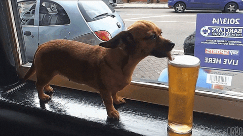

# To Beer Or Not To Beer
Phil Hurst, Emily Resch, Peter Blank

 

## Technologies used
* Materialize framework for CSS
* Punk API
* Edamam API
* Animate On Scroll Library

We linked our page to the Materialize CDN so that we could set up our page in grid format and use some of the features provided by the framwork. Our site includes a slider, dropdown, and checkboxes all thanks to the css framework. To call beer choices for the user we used Punk API, a free and open source API that has a wide selection of Brewdog's beers in it's database. There is no authenticaiton required to use the API, and they set limits from IP addresses with a rate limit of 3600 requests per hour. When the user searches for their beer, the data returned is put into an AJAX call to grab recommended food items from the Edamam API. 

## How it works
We created a web page for users to find different beers based on their preferences. The user is able to select beer based on the alcohol content, color, and bitterness. 

...if a user enters parameters that brewdog does not have, they will be notified!

       

## Food Selection
We used the data from Punk API as paramters in an AJAX call to the Edamam API, to make food selections that go well with the suggested beer.

As a helpful tip, Brewdog has a larger selection of beers with higher IBUs and darker shades, and the user will have more fun looking up some brew using these paramters. Cheers!

       

